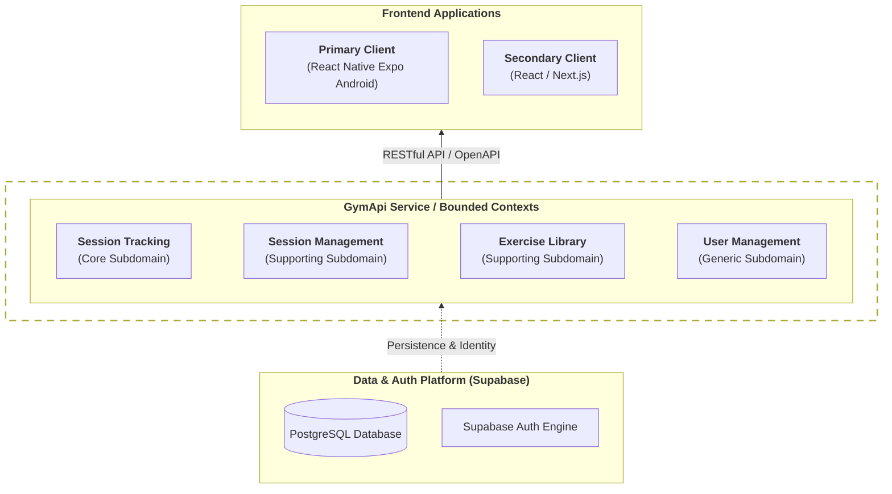

# Kiss Gym API

Kiss Gym is a freeware gym training tracker focused on simplicity and flexibility. It prioritizes ad-hoc training
sessions over rigid planning.

## Intention

The project aims to provide a lightweight backend for gym tracking where training plans are emergent rather than
prescribed. Each session inherits the sequence of exercises from the previous one, allowing for natural progression
without the overhead of explicit plan management.

## Architecture

<div style="zoom: 0.6;">



</div>

- **Backend:** ASP.NET Core C# (RESTful API with OpenAPI/Swagger).
- **Deployment:** Azure Container Apps.
- **Data & Auth:** Supabase (PostgreSQL + Auth engine).
- **Frontend (Primary):** React Native Expo (Android).
- **Frontend (Secondary):** React / Next.js.

### Bounded Contexts

- **Session Tracking (Core):** Real-time tracking of the active session.
- **Session Management (Supporting):** Historical data, editing, and deletion.
- **Exercise Library (Supporting):** Management of exercises, media, and custom properties.
- **User Management (Generic):** Authentication and user profiles via Supabase.

## Features

- **Session Inheritance:** Start new sessions based on the latest exercise sequence.
- **Dynamic Exercises:** Support for images, timing (start/max/real), automatic labels, and custom property lists.
- **API First:** Fully documented via OpenAPI for seamless frontend integration.
- **Coming Soon:** Calendar planning and reminders.

## Set up Supabase

### Requirements

- **.NET 10.0 SDK** or higher.
- **Supabase** instance on supabase.com (free tier is sufficient).

### Steps

1. Create a new project at [supabase.com](https://supabase.com).
    - Region: choose closest to your users (e.g. Frankfurt for Europe).
    - Save the database password — you will need it for the connection string.
    - Disable **Data API** (your .NET API is the only DB client).
    - Enable **automatic RLS** (secure by default).

2. From **Project Settings → API**, copy:
    - **Project URL** → `Supabase:Url` in `appsettings.json`
    - **Publishable key** → `Supabase:AnonKey` in `appsettings.json` (if needed)

3. From **Project Settings → Connect → Session pooler**, copy the connection string.  
   Use the **Session Pooler** (port 5432) — required for Azure compatibility (IPv4).  
   Use the **Direct connection** locally for running EF migrations.

4. Create the user profile trigger manually in **Dashboard → SQL Editor**:

```sql
create or replace function public.handle_new_user()
returns trigger as $$
begin
    insert into public.users (id, email, name)
    values (
        new.id,
        new.email,
        coalesce(new.raw_user_meta_data->>'name', new.email)
    );
    return new;
end;
$$ language plpgsql security definer;

create trigger on_auth_user_created
    after insert on auth.users
    for each row execute procedure public.handle_new_user();
```

> **Note:** This trigger cannot be applied via EF Core migrations due to Supabase's
> `auth` schema ownership restrictions on the free tier. It must be created once
> manually via the SQL Editor.

---

## Developer Build

### Requirements

- **.NET 10.0 SDK** or higher.
- **Recommended IDE:** Visual Studio 2026, JetBrains Rider, or VS Code.
- A Supabase project (see [Set up Supabase](#set-up-supabase)).

### Local Setup

1. Clone the repository:
   ```bash
   git clone https://github.com/kiss-gym/gym-api.git
   cd gym-api
   ```

2. Create `GymApi.Api/appsettings.Development.json` (gitignored — never commit):
   ```json
   {
     "Supabase": {
       "ConnectionString": "Host=db.<project-ref>.supabase.co;Port=5432;Database=postgres;Username=postgres;Password=<db-password>;SSL Mode=Require;"
     }
   }
   ```
   Use the **Direct connection** string here — required for EF migrations.

3. Build the solution:
   ```bash
   dotnet build
   ```

4. Apply database migrations:
   ```bash
   dotnet ef database update \
     --project GymApi.Infrastructure/GymApi.Infrastructure.csproj \
     --startup-project GymApi.Api/GymApi.Api.csproj
   ```

5. Create the user profile trigger manually in Supabase SQL Editor — see [Set up Supabase](#set-up-supabase).

6. Run the API:
   ```bash
   dotnet run --project GymApi.Api
   ```

7. Open Swagger UI at `http://localhost:5000/swagger`.

### Running Tests

```bash
# All tests (unit + integration)
dotnet test

# Integration tests only (requires Supabase connection)
dotnet test --filter Category=Integration

# Unit tests only
dotnet test --filter Category!=Integration
```

---

## Productive Build

### Requirements

- **.NET 10.0 SDK** or higher.
- **Azure** subscription with a Web App and Key Vault configured.
- A Supabase project (see [Set up Supabase](#set-up-supabase)).

### Setup on Azure

1. **Create Azure resources** (first time only):
    - Resource Group, App Service Plan, and Web App via the deployment script (see below).
    - Key Vault with the connection string secret:
        - Secret name: `Supabase-ConnectionString`
        - Secret value: Session Pooler connection string from Supabase.

2. **Enable Managed Identity** on the Web App:
    - Portal → Web App → **Identity** → System assigned → **On**.

3. **Grant Key Vault access** to the Web App:
    - Key Vault → **Access control (IAM)** → Add role assignment → **Key Vault Secrets User** → assign to the Web App's managed identity.

4. **Add environment variables** to the Web App:
    - Portal → Web App → **Environment variables** → Add:

   | Name | Value |
   |---|---|
   | `Supabase__Url` | `https://<project-ref>.supabase.co` |
   | `Supabase__ConnectionString` | `@Microsoft.KeyVault(SecretUri=https://<vault-name>.vault.azure.net/secrets/Supabase-ConnectionString/)` |

### Compile and Deploy

Run the PowerShell deployment script from the solution root:

```powershell
.\PublishMe.ps1
```

The script:
- Publishes the .NET API in Release mode
- Zips the output
- Creates Azure resources if they don't exist (skips if already present)
- Deploys the zip to the Web App via `Publish-AzWebApp`

> **Note:** The script skips Web App creation if it already exists, preserving all
> manually configured environment variables and Key Vault references.

After deployment, verify at:
```
https://<web-app-name>.azurewebsites.net/swagger
```

## License

This project is licensed under the [MIT License](LICENSE).

## Contact

Eduard Danziger
