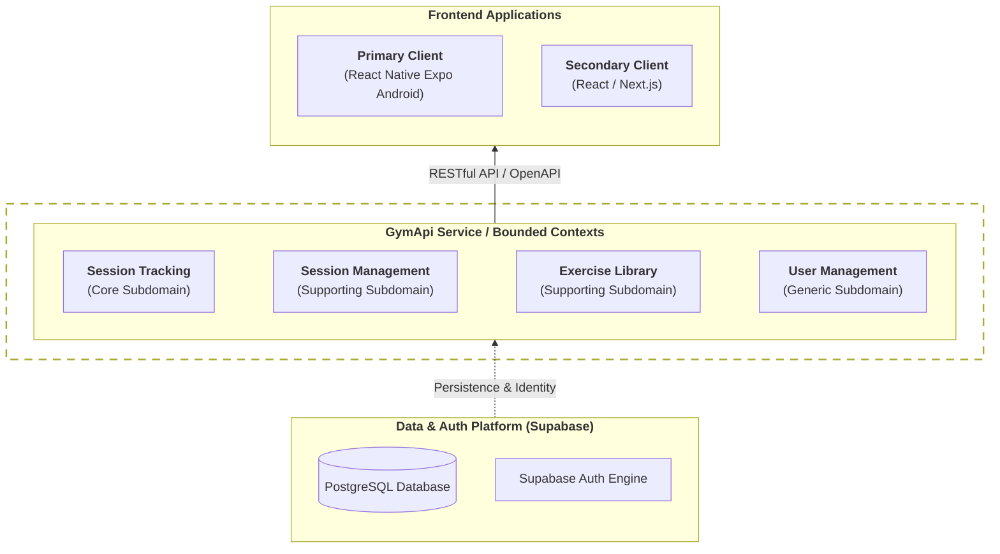

# Kiss Gym API

Kiss Gym is a freeware gym training tracker focused on simplicity and flexibility. It prioritizes ad-hoc training sessions over rigid planning.

## Intention

The project aims to provide a lightweight backend for gym tracking where training plans are emergent rather than prescribed. Each session inherits the sequence of exercises from the previous one, allowing for natural progression without the overhead of explicit plan management.

## Architecture

<div style="zoom: 0.6;">



</div>

- **Backend:** ASP.NET Core C# (RESTful API with OpenAPI/Swagger).
- **Deployment:** Azure Container Apps.
- **Data & Auth:** Supabase (PostgreSQL + Auth engine).
- **Frontend (Primary):** React Native Expo (Android).
- **Frontend (Secondary):** React / Next.js.

### Bounded Contexts
- **Current Session Tracking (Core):** Real-time tracking of the active session.
- **Session Management (Supporting):** Historical data, editing, and deletion.
- **Exercise Library (Supporting):** Management of exercises, media, and custom properties.
- **User Management (Generic):** Authentication and user profiles via Supabase.

## Features

- **Session Inheritance:** Start new sessions based on the latest exercise sequence.
- **Dynamic Exercises:** Support for images, timing (start/max/real), automatic labels, and custom property lists.
- **API First:** Fully documented via OpenAPI for seamless frontend integration.
- **Coming Soon:** Calendar planning and reminders.


## Developer Build

### Requirements
- **.NET 10.0 SDK** or higher.
- **Supabase** instance (local or cloud).
- **IDE:** Visual Studio 2026, JetBrains Rider, or VS Code.

### Local Setup

1. Clone the repository.
2. Configure environment variables in `appsettings.Development.json` (Supabase URL, API Key).
3. Restore dependencies:
   ```bash
   dotnet restore
   ```
4. Build the solution:
   ```bash
   dotnet build
   ```
5. Run the API:
   ```bash
   dotnet run --project GymApi.Api
   ```
6. Access Swagger UI at `http://localhost:<port>/swagger`.

## Run Tests

Execute the test suite using the .NET CLI:
```bash
dotnet test
```

## License

This project is licensed under the [MIT License](LICENSE).

## Contact

Eduard Danziger
